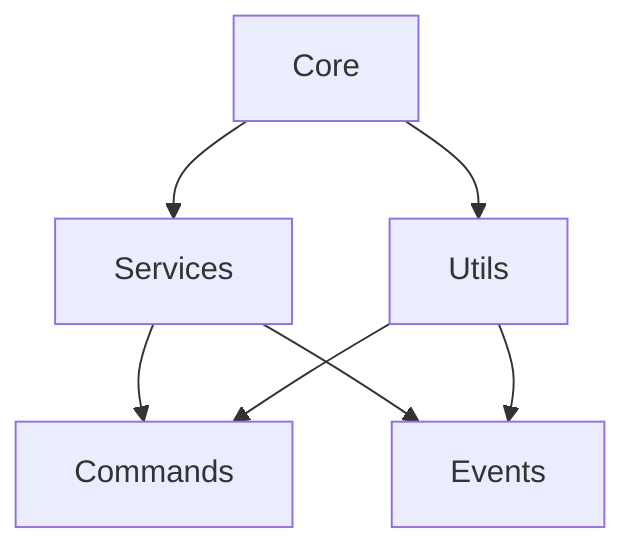
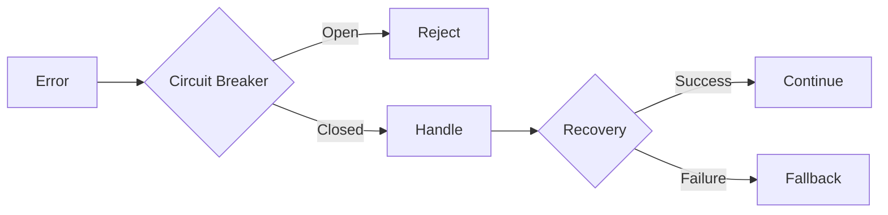
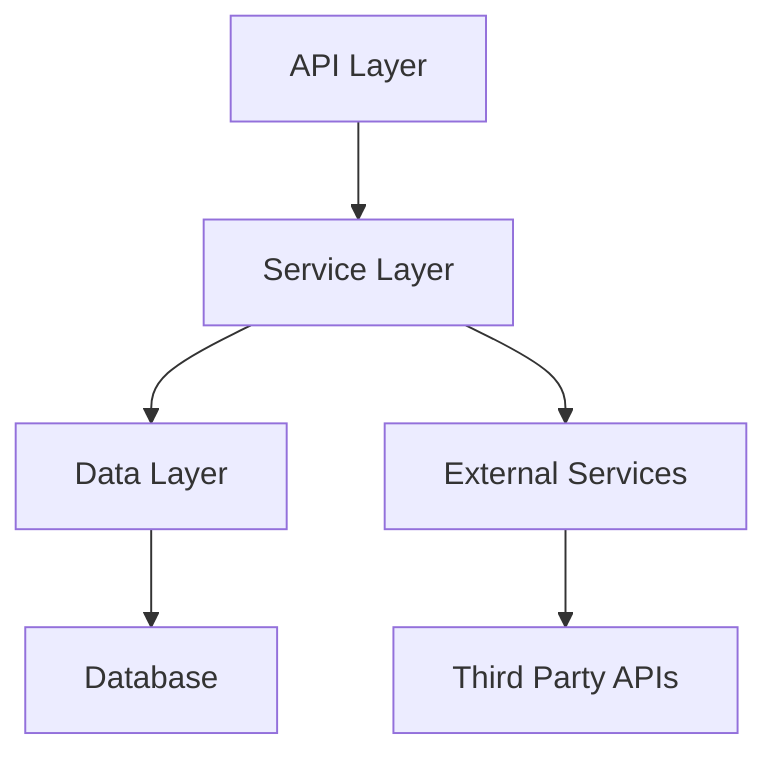

# KATZ Coding Standards & Best Practices

## 1. File Organization

### Module Structure
- Each module should have a clear, single responsibility
- Use index.js files to expose public interfaces
- Group related functionality into feature folders
- Maintain consistent file naming conventions

```
src/
├── core/           # Core system functionality
├── services/       # Business logic and external services
├── commands/       # Command handlers
├── models/         # Data models
├── utils/          # Shared utilities
└── events/         # Event handlers
```

### File Size Guidelines
- Keep files under 300 lines of code
- Split large files into focused modules
- Extract reusable logic into utility functions
- Create separate files for different concerns

### Naming Conventions
- Use kebab-case for file names
- Use PascalCase for class names
- Use camelCase for variables and functions
- Use UPPER_CASE for constants

## 2. Code Organization

### Class Structure
```javascript
class ServiceName {
  // Private properties first
  #privateProperty;

  // Constructor
  constructor() {
    // Initialize properties
  }

  // Public methods
  publicMethod() {
    // Implementation
  }

  // Private methods
  #privateMethod() {
    // Implementation
  }
}
```

### Function Organization
- Group related functions together
- Order functions by dependency
- Place helper functions near their usage
- Keep functions focused and small

## 3. Error Handling

### Circuit Breaker Pattern
```javascript
async function executeWithBreaker(service, fn) {
  return circuitBreakers.executeWithBreaker(
    service,
    async () => {
      try {
        return await fn();
      } catch (error) {
        throw new ServiceError(error);
      }
    },
    BREAKER_CONFIGS[service]
  );
}
```

### Error Types
- Use specific error classes
- Include relevant error context
- Maintain error hierarchies
- Implement proper error recovery

## 4. Performance Optimization

### Caching Strategy
```javascript
class CacheManager {
  #cache = new Map();
  #ttl;

  constructor(ttl = 5 * 60 * 1000) {
    this.#ttl = ttl;
  }

  set(key, value) {
    this.#cache.set(key, {
      value,
      timestamp: Date.now()
    });
  }

  get(key) {
    const item = this.#cache.get(key);
    if (!item) return null;
    
    if (Date.now() - item.timestamp > this.#ttl) {
      this.#cache.delete(key);
      return null;
    }
    
    return item.value;
  }
}
```

### Resource Management
- Implement proper cleanup
- Use connection pooling
- Monitor memory usage
- Optimize network calls

## 5. Testing Guidelines

### Test Structure
```javascript
describe('ServiceName', () => {
  let service;

  beforeEach(() => {
    service = new ServiceName();
  });

  describe('methodName', () => {
    it('should handle successful case', async () => {
      // Test implementation
    });

    it('should handle error case', async () => {
      // Test implementation
    });
  });
});
```

### Test Coverage
- Unit tests for business logic
- Integration tests for services
- End-to-end tests for critical paths
- Performance tests for bottlenecks

## 6. Documentation

### Code Documentation
```javascript
/**
 * Executes a trade with the specified parameters
 * @param {Object} params - Trade parameters
 * @param {string} params.action - Trade action (buy/sell)
 * @param {string} params.tokenAddress - Token address
 * @param {string} params.amount - Trade amount
 * @returns {Promise<Object>} Trade result
 * @throws {TradeError} If trade execution fails
 */
async function executeTrade(params) {
  // Implementation
}
```

### API Documentation
- Document public interfaces
- Include usage examples
- Document error scenarios
- Maintain changelog

## 7. Security Best Practices

### Data Protection
```javascript
class SecureStorage {
  #encryptionKey;

  constructor(key) {
    this.#encryptionKey = key;
  }

  async store(data) {
    const encrypted = await encrypt(data, this.#encryptionKey);
    return encrypted;
  }

  async retrieve(encrypted) {
    const decrypted = await decrypt(encrypted, this.#encryptionKey);
    return decrypted;
  }
}
```

### Input Validation
- Validate all inputs
- Sanitize user data
- Use parameterized queries
- Implement rate limiting

## Tools for Visualization

### Documentation Generation
- [JSDoc](https://jsdoc.app/) for API documentation
- [Docusaurus](https://docusaurus.io/) for documentation site
- [VuePress](https://vuepress.vuejs.org/) for technical documentation

### Diagram Generation
- [Mermaid](https://mermaid-js.github.io/) for flow diagrams
- [PlantUML](https://plantuml.com/) for UML diagrams
- [Draw.io](https://draw.io/) for architecture diagrams

### Code Analysis
- [SonarQube](https://www.sonarqube.org/) for code quality
- [ESLint](https://eslint.org/) for code style
- [Istanbul](https://istanbul.js.org/) for code coverage

### Performance Monitoring
- [Grafana](https://grafana.com/) for metrics visualization
- [Prometheus](https://prometheus.io/) for monitoring
- [New Relic](https://newrelic.com/) for performance tracking

## Example Visualizations

### Module Dependencies


### Error Flow


### Service Architecture
