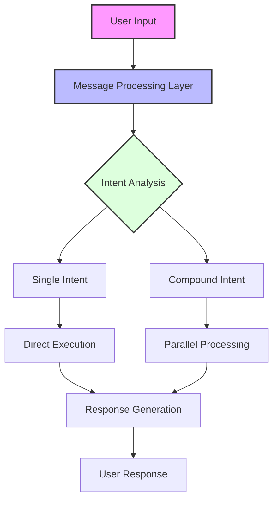
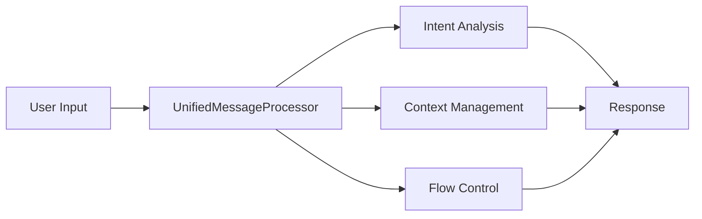
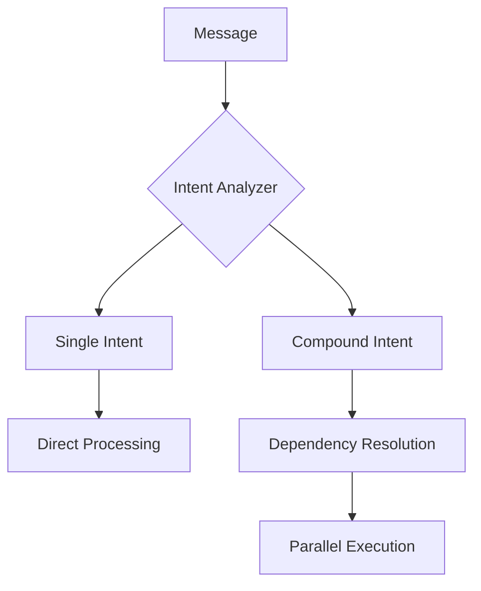
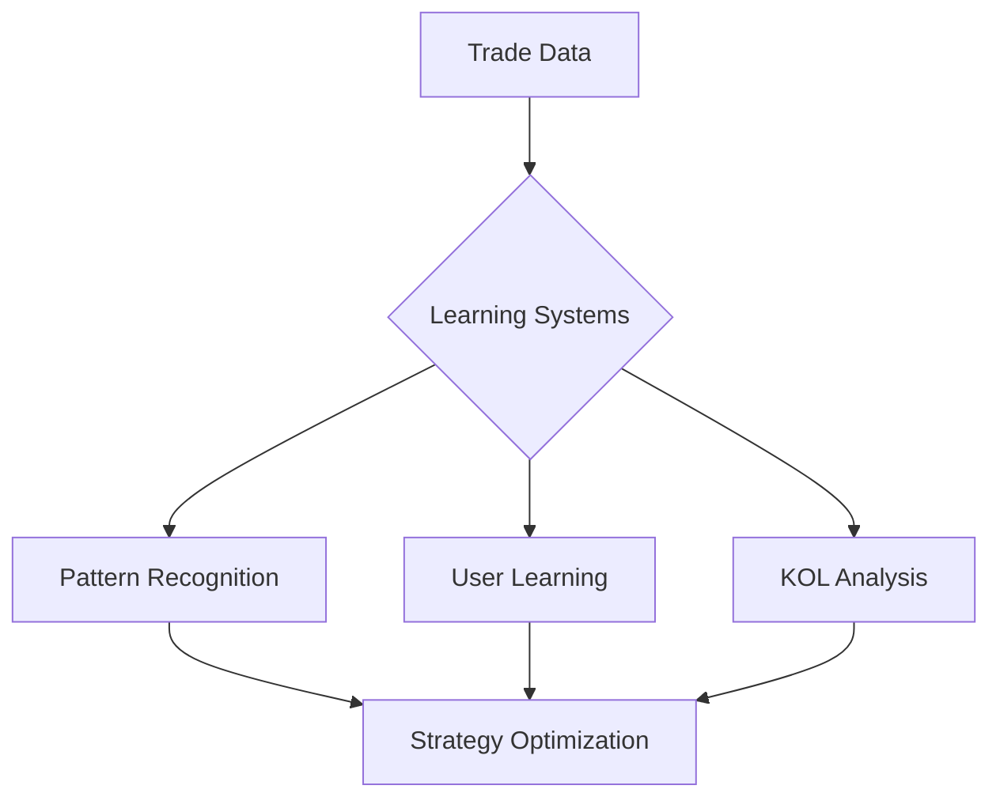
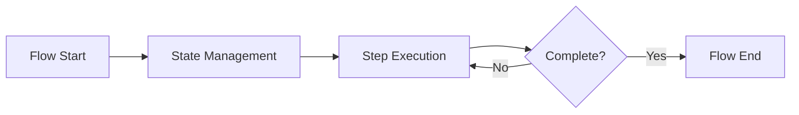
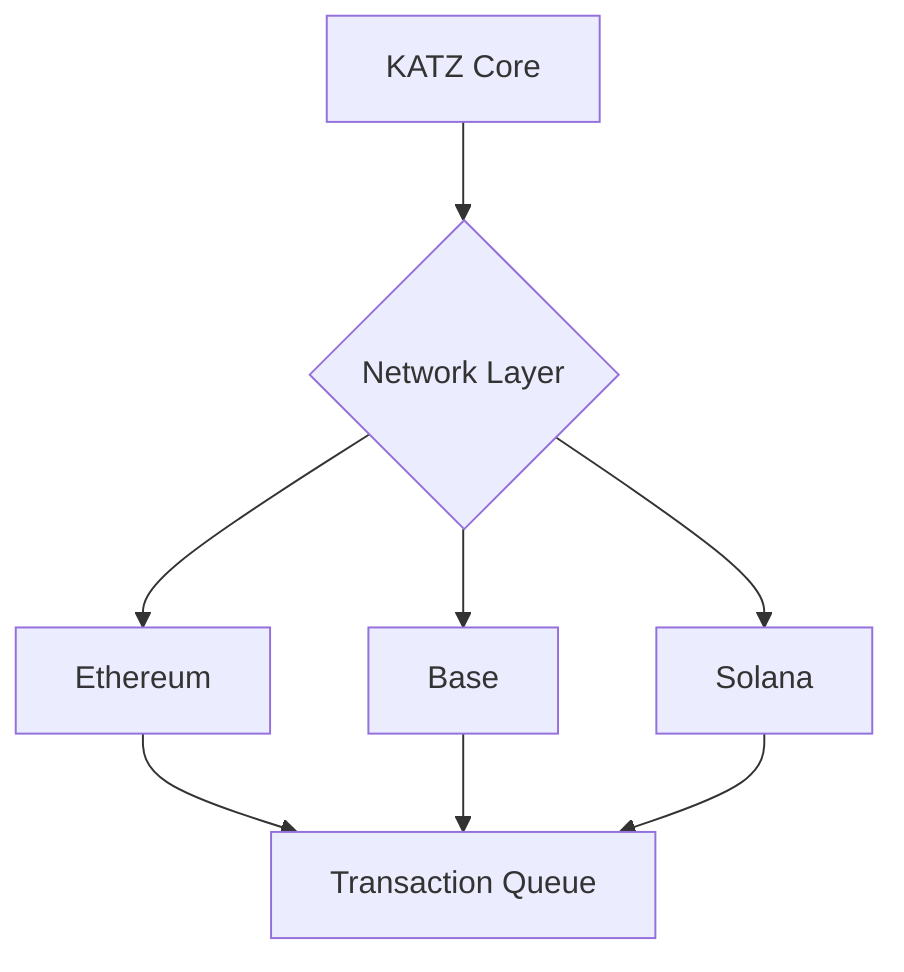
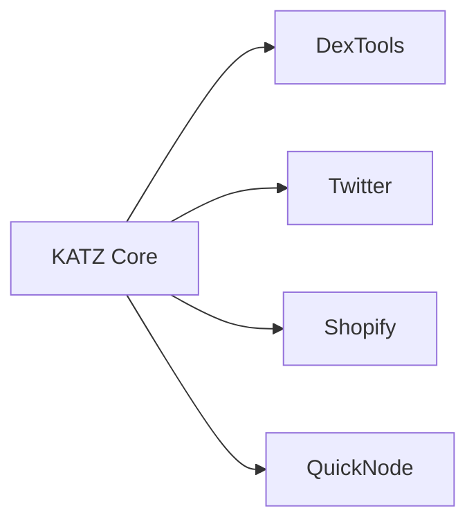
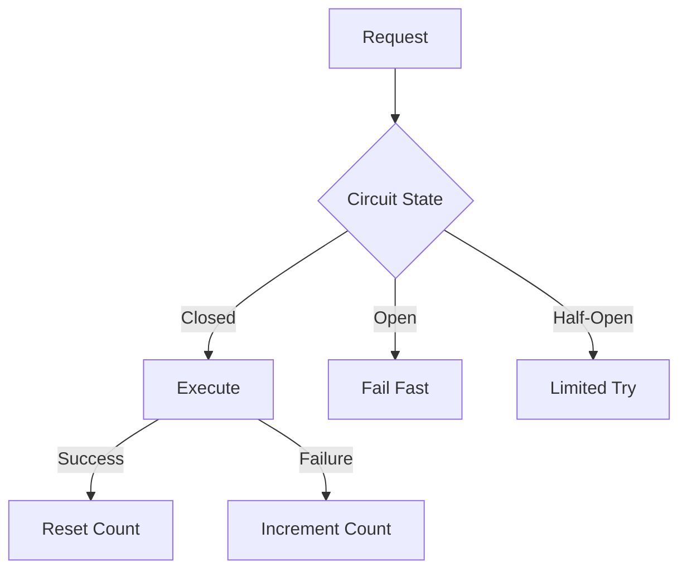
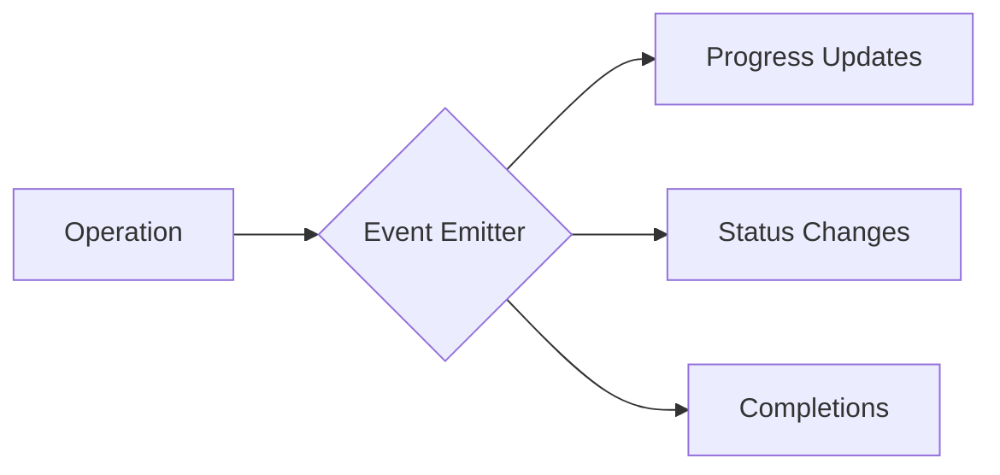
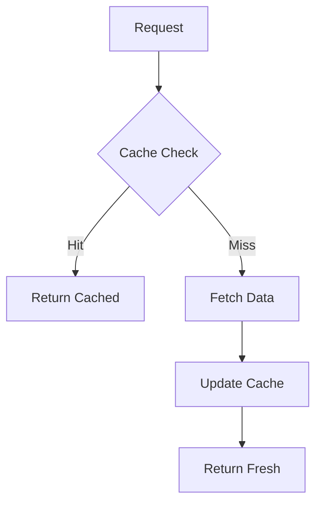

# KATZ Architecture Documentation

## System Overview

KATZ employs a modular, event-driven architecture designed for real-time trading operations across multiple blockchains.



## Core Components

### 1. Message Processing Layer

The message processing layer handles all incoming user interactions:



#### Key Features:
- Natural language understanding
- Context awareness
- Multi-step flow management
- Error recovery
- Progress tracking

### 2. Intent Processing System

The intent system classifies and routes user requests:



#### Implementation Example:
```typescript
class IntentAnalyzer {
  async analyzeIntent(text, context) {
    // Check for compound patterns
    const patterns = this.detectCompoundPatterns(text);
    
    return patterns.length > 0
      ? this.analyzeCompoundIntent(text, patterns)
      : this.analyzeSingleIntent(text);
  }
}
```

### 3. Learning Systems

KATZ employs multiple learning systems for continuous improvement:



#### Components:
1. Pattern Recognition
2. User Learning
3. KOL Analysis
4. Strategy Optimization

### 4. Flow Management

Handles complex multi-step operations:



#### Example Flow:
```typescript
class TradeFlow extends BaseFlow {
  steps = ['token', 'amount', 'confirmation'];
  
  async processStep(state, input) {
    switch(this.steps[state.currentStep]) {
      case 'token':
        return this.handleTokenStep(input);
      case 'amount':
        return this.handleAmountStep(input);
      case 'confirmation':
        return this.handleConfirmation(input);
    }
  }
}
```

## Integration Architecture

### 1. Blockchain Integration



### 2. External Services



## Error Handling & Recovery

### 1. Circuit Breaker Pattern



### 2. Retry Management

```typescript
class RetryManager {
  async executeWithRetry(operation) {
    for (let attempt = 1; attempt <= maxRetries; attempt++) {
      try {
        return await operation();
      } catch (error) {
        if (attempt === maxRetries) throw error;
        await this.delay(attempt);
      }
    }
  }
}
```

## Progress Tracking

### 1. Event System



### 2. Progress Notifications

```typescript
async updateProgress(userId, status) {
  this.emit('progress', {
    userId,
    type: status.type,
    message: status.message,
    timestamp: Date.now()
  });
}
```

## Performance Optimization

### 1. Caching Strategy



### 2. Parallel Processing

```typescript
async processParallel(tasks) {
  return Promise.all(
    tasks.map(task => 
      this.queue.add(() => this.processTask(task))
    )
  );
}
```

## Best Practices

### 1. Code Organization
- Modular architecture
- Clear separation of concerns
- Dependency injection
- Event-driven design

### 2. Error Handling
- Circuit breakers
- Retry mechanisms
- Graceful degradation
- Error recovery

### 3. Performance
- Connection pooling
- Request batching
- Cache optimization
- Resource monitoring

### 4. Security
- Input validation
- Rate limiting
- Access control
- Secure storage

## Future Enhancements

### 1. Advanced AI
- Deep learning integration
- Predictive analytics
- Pattern recognition
- Strategy evolution

### 2. Scalability
- Horizontal scaling
- Load balancing
- Service mesh
- Distributed caching

### 3. Monitoring
- Real-time metrics
- Performance tracking
- Error reporting
- Health checks