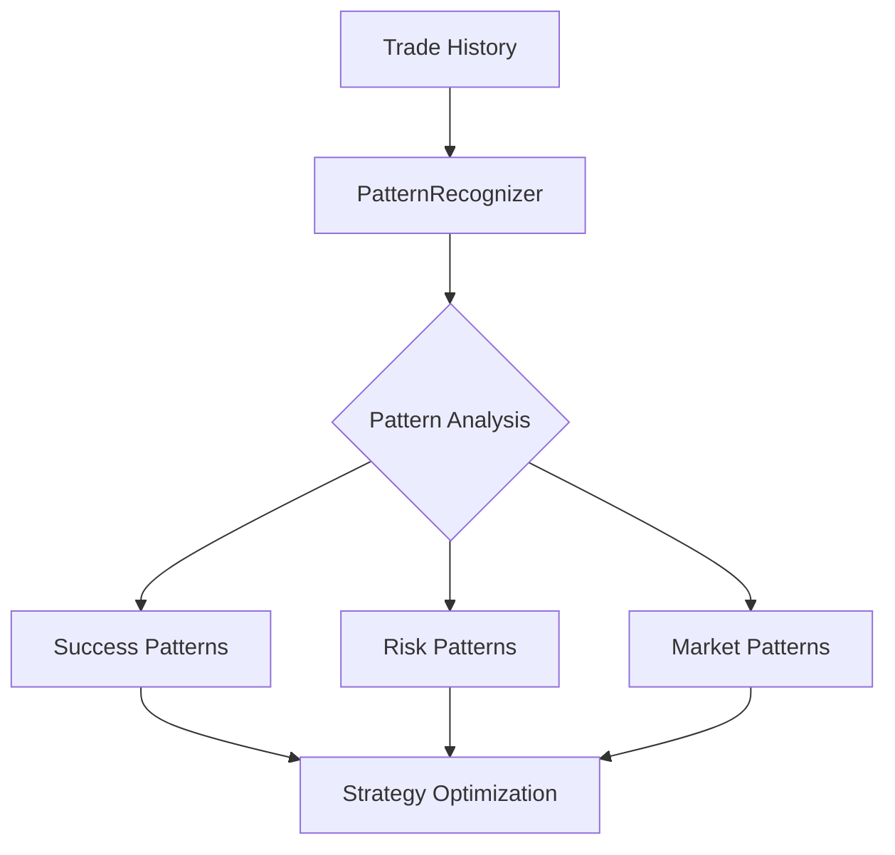
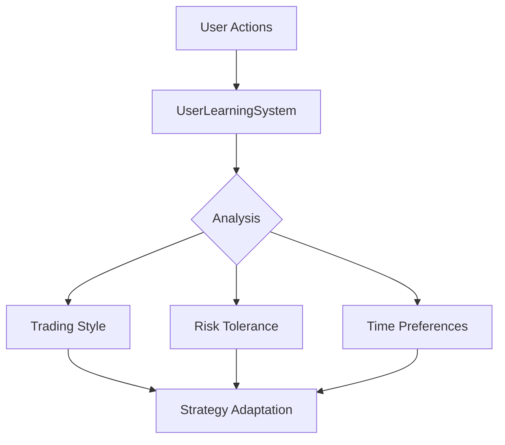
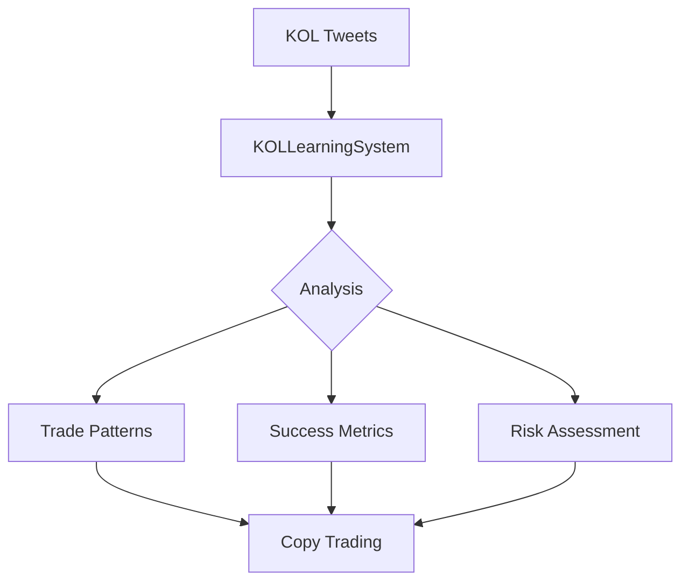
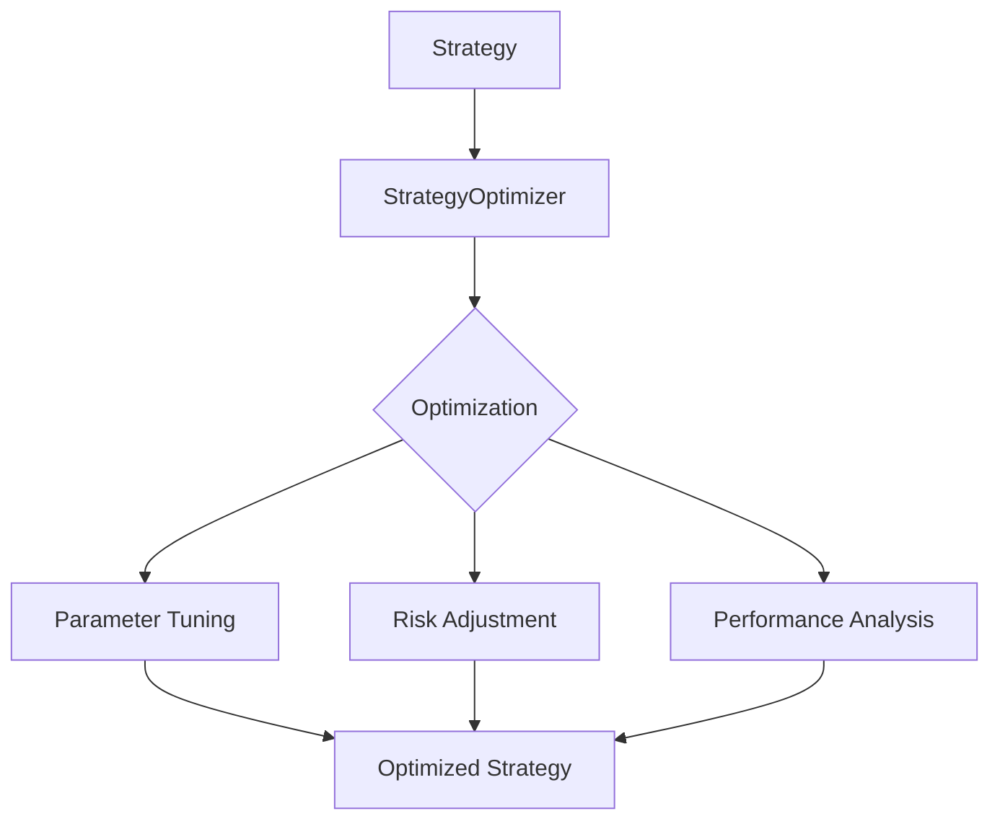

# KATZ Learning Systems Documentation

## Overview

KATZ employs multiple interconnected learning systems that work together to continuously improve trading performance and user interaction.

## Core Learning Systems

### 1. Pattern Recognition System


#### Current Capabilities
- Trade pattern identification
- Success rate calculation
- Risk factor analysis
- Pattern scoring & ranking
- Historical validation

#### Implementation
```typescript
class PatternRecognizer {
  async analyzePatterns(tradeHistory) {
    const patterns = await this.extractPatterns(tradeHistory);
    const validated = await this.validatePatterns(patterns);
    return this.rankPatterns(validated);
  }
}
```

### 2. User Learning System


#### Current Capabilities
- Trading style analysis
- Risk tolerance assessment
- Time preference tracking
- Strategy customization
- Performance tracking

#### Example Usage
```typescript
// Update user preferences based on trade
await userLearningSystem.updateUserPreferences(userId, {
  trade: {
    token: 'BONK',
    amount: '1',
    exitStrategy: {
      type: 'multi_target',
      targets: [
        { percentage: 50, multiplier: 2 },
        { percentage: 50, multiplier: 3 }
      ]
    }
  }
});
```

### 3. KOL Learning System


#### Current Capabilities
- Tweet analysis
- Trade signal detection
- Performance tracking
- Risk assessment
- Pattern matching

#### Implementation Example
```typescript
class KOLLearningSystem {
  async analyzeKOLPatterns(handle) {
    const tweets = await twitterService.searchTweets(handle);
    const trades = await this.getKOLTrades(handle);
    const patterns = await this.extractKOLPatterns(tweets, trades);
    return this.rankPatterns(patterns);
  }
}
```

### 4. Strategy Optimization System


#### Current Capabilities
- Strategy variation generation
- Performance simulation
- Risk-adjusted optimization
- Parameter tuning
- A/B testing

#### Usage Example
```typescript
const optimizedStrategy = await strategyOptimizer.optimizeStrategy({
  currentStrategy,
  performance: {
    winRate: 65,
    profitFactor: 1.8,
    maxDrawdown: 15
  }
});
```

## Integration Examples

### Scenario 1: FlipperMode Optimization
```typescript
// 1. Analyze trade history
const patterns = await patternRecognizer.analyzePatterns(tradeHistory);

// 2. Get user preferences
const preferences = await userLearningSystem.getUserPreferences(userId);

// 3. Optimize strategy
const optimizedStrategy = await strategyOptimizer.optimizeStrategy({
  patterns,
  preferences,
  currentStrategy: flipperConfig
});

// 4. Apply new strategy
await flipperMode.updateConfig(userId, optimizedStrategy);
```

### Scenario 2: KOL Copy Trading
```typescript
// 1. Analyze KOL patterns
const kolPatterns = await kolLearningSystem.analyzeKOLPatterns('@ChillGuyKOL');

// 2. Match with user preferences
const userPrefs = await userLearningSystem.getUserPreferences(userId);
const matchScore = await strategyManager.matchPatternToPreferences(kolPatterns, userPrefs);

// 3. Configure copy trading
if (matchScore > 0.8) {
  await copyTrading.startCopying(userId, '@ChillGuyKOL', {
    amount: '0.5 SOL',
    maxPositions: 3,
    riskLimit: userPrefs.riskTolerance
  });
}
```

### Scenario 3: Multi-Target Order Optimization
```typescript
// 1. Analyze token performance
const tokenAnalysis = await patternRecognizer.analyzeTokenPatterns('BONK');

// 2. Get user's trading style
const tradingStyle = await userLearningSystem.getTradingStyle(userId);

// 3. Generate optimized targets
const targets = await strategyOptimizer.generateTargets({
  token: 'BONK',
  analysis: tokenAnalysis,
  style: tradingStyle
});

// 4. Create order
await multiTargetOrder.create(userId, {
  token: 'BONK',
  amount: '1 SOL',
  targets
});
```

## Future Expansions

### 1. Advanced Pattern Recognition
- Deep learning models for pattern detection
- Real-time pattern matching
- Market regime detection
- Correlation analysis

### 2. Enhanced User Learning
- Behavioral analysis
- Psychological profiling
- Risk tolerance adaptation
- Time preference learning

### 3. Improved KOL Analysis
- Sentiment analysis
- Influence scoring
- Network effect analysis
- Cross-platform monitoring

### 4. Strategy Evolution
- Genetic algorithms
- Neural network optimization
- Multi-factor analysis
- Market adaptation

### 5. Integration Opportunities
- TradingView integration
- Custom indicator development
- External data sources
- Machine learning models

## Best Practices

1. **Data Collection**
   - Structured logging
   - Performance metrics
   - Error tracking
   - User feedback

2. **Analysis**
   - Regular pattern updates
   - Performance validation
   - Risk assessment
   - Strategy backtesting

3. **Optimization**
   - Gradual parameter updates
   - A/B testing
   - Performance monitoring
   - Risk management

4. **Integration**
   - Service coordination
   - Data consistency
   - Error handling
   - Progress tracking